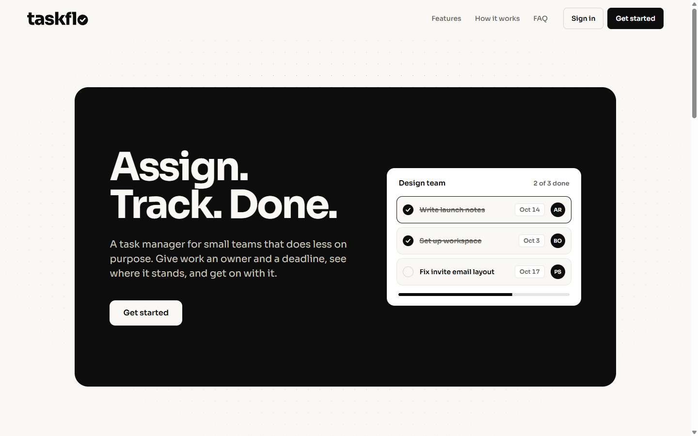
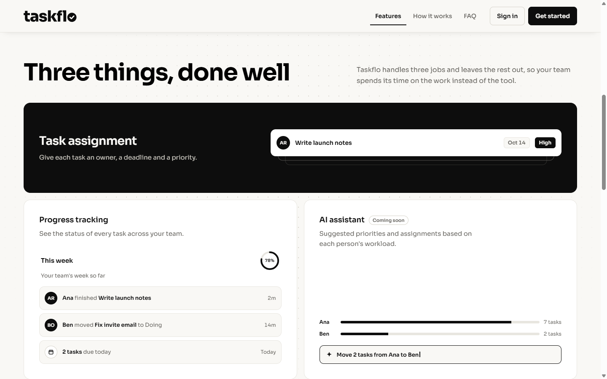
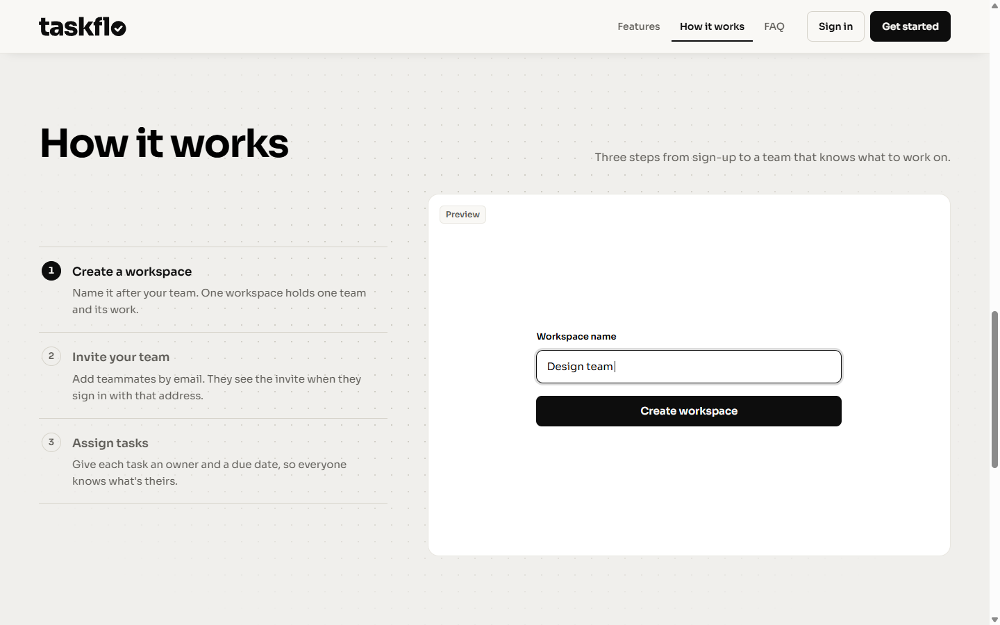
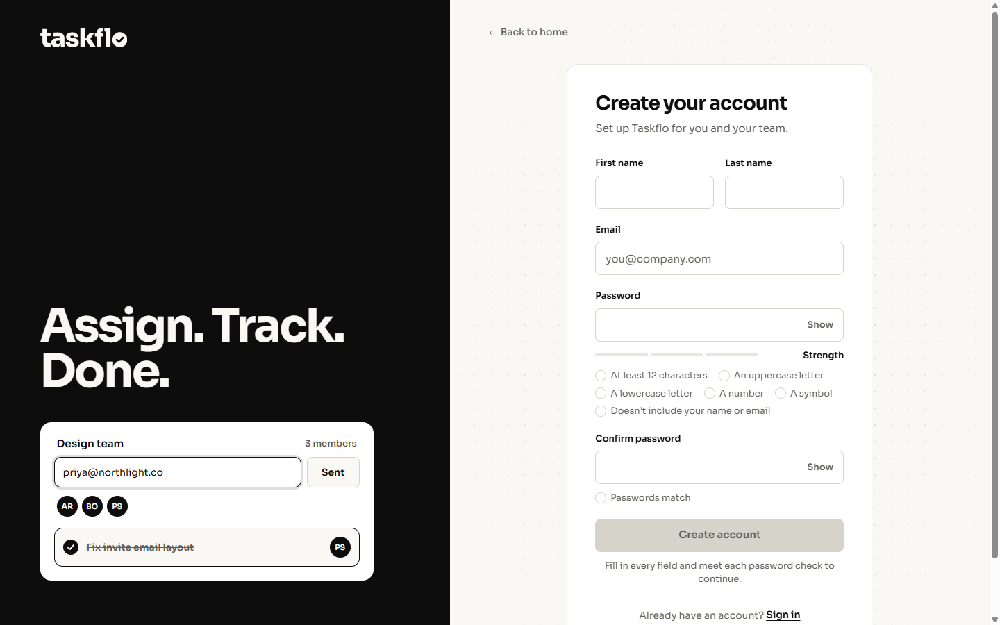
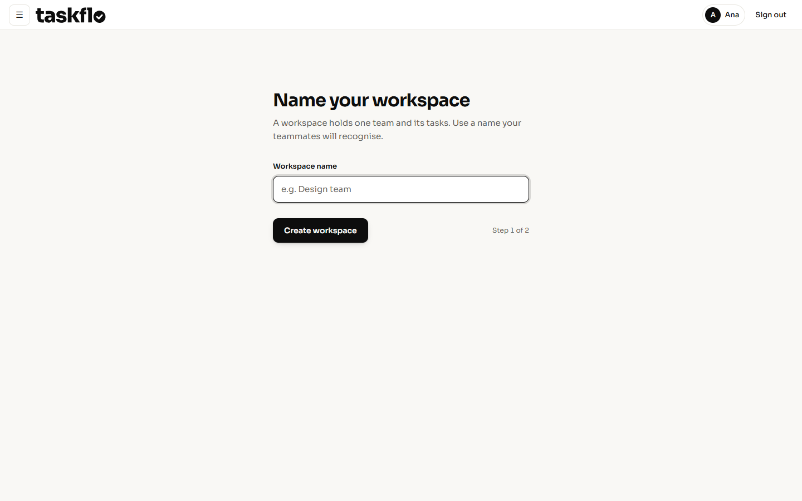

<p align="center">
  
</p>

<p align="center"><strong>Assign. Track. Done.</strong></p>

Taskflo is a task manager for small teams that does less on purpose. Give work an owner and a deadline, see where it stands, and get on with it.



## Screenshots

| Features | How it works |
| --- | --- |
|  |  |

| Sign up | First-run dashboard |
| --- | --- |
|  |  |

## Features

**Works now**

- **Workspaces.** One workspace per team, created during a short first-run setup.
- **Invites by email.** Add teammates by email. Invites last 7 days, can be used once, and wait for the invitee when they sign in with that address.
- **Tasks with owners and due dates.** The tasks table and its access rules are in place. The task screens are next on the roadmap.
- **Secure auth.** Email sign-up with a 6-digit verification code, a live password checklist, a strength meter, and a block on passwords that include your name or email.

**Planned**

- **AI workload assistant** (coming soon). Suggested priorities and assignments based on each person's workload.

## Tech stack

- **Frontend:** React, TypeScript, Vite, Motion, React Router
- **Backend:** Supabase (Postgres, Auth, row-level security), plus a minimal Express server
- **Password strength:** zxcvbn-ts, loaded only when someone types a password

## Getting started

### Prerequisites

- Node.js 20.19+ or 22.12+ and npm
- A Supabase project
- The Supabase CLI, if you want to apply migrations from the terminal

### Install

```sh
git clone <repo-url> taskflo
cd taskflo/my-task-manager
npm install
```

### Environment

Copy the example file and fill in the values from your Supabase project (Project settings, API):

```sh
cp .env.example .env
```

| Variable | What it is |
| --- | --- |
| `VITE_SUPABASE_URL` | Your Supabase project URL |
| `VITE_SUPABASE_ANON_KEY` | Your project's anon (public) key |

Only use the anon key here. Never put the service role key in the frontend or commit `.env`.

### Run

```sh
npm run dev
```

The app runs at http://localhost:5173.

The Express server in `backend/` is optional for now:

```sh
cd ../backend
npm install
node server.js
```

## Database

Schema changes live in `supabase/migrations/` and run in filename order. To apply them with the Supabase CLI:

```sh
supabase link --project-ref <your-project-ref>
supabase db push
```

You can also paste each file into the Supabase SQL editor, oldest first.

The migrations build on a base schema (`Users`, `workspaces`, `workspace_members` and the `handle_new_user` sign-up trigger) that isn't in the repo yet. Until a baseline migration is added, they won't set up a brand-new project on their own.

Every table uses row-level security. Policies limit each user to their own data and the workspaces they belong to.

## Project structure

```
taskflo/
├── my-task-manager/        React app (Vite)
│   ├── public/
│   └── src/
│       ├── assets/         Wordmark and static assets
│       ├── components/     Navbar, auth layout, demos, password field
│       ├── hooks/          Shared hooks
│       ├── pages/          Landing, sign in, sign up, dashboard
│       ├── services/       Supabase data access
│       └── utils/          Motion tokens, password rules
├── backend/                Minimal Express server
├── supabase/
│   └── migrations/         SQL migrations
└── docs/
    └── screenshots/        Images used in this README
```

## Security

- **No secrets in the repo.** `.env` files are gitignored, and `.env.example` holds placeholders only.
- **Row-level security on every table.** Access is checked in Postgres, not trusted from the client.
- **Password rules in Supabase Auth.** Supabase enforces at least 12 characters with uppercase, lowercase, a number and a symbol. The sign-up form also checks strength and blocks passwords that include your name or email.
- **Locked-down database functions.** `security definer` functions use an empty `search_path` and aren't executable by `anon` unless they must be.

## Roadmap

- [ ] Task screens: create, assign, set due dates and check off tasks
- [ ] Baseline migration for the full schema
- [ ] Password reset flow
- [ ] AI workload assistant
- [ ] Tests for auth and workspace flows
